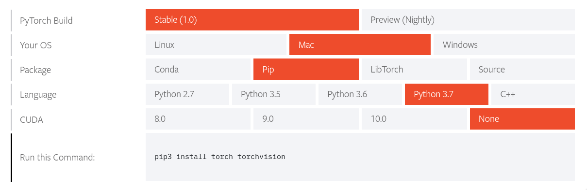
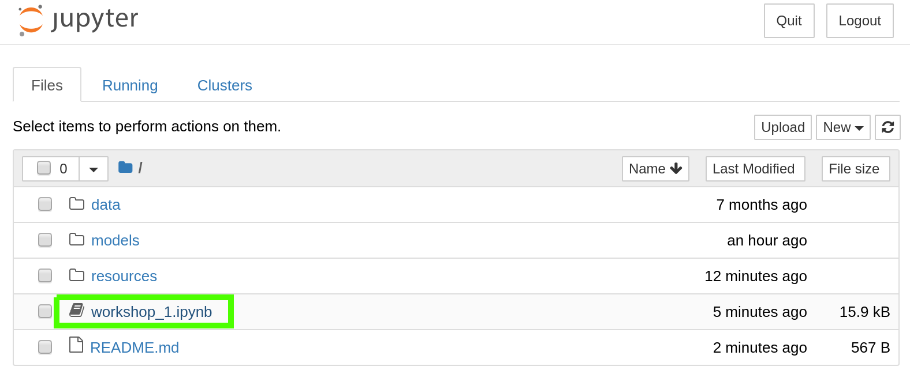

# Installation and Setup

##### Install Python

https://www.python.org/downloads/release/python-373/

##### Install prerequisite dependencies
```
pip install numpy jupyter matplotlib pillow tqdm
```

##### Install PyTorch! https://pytorch.org/get-started/locally/



##### Open this interactive Notebook on your computer!

```bash
git clone https://github.com/sjsumlclub/workshop-simple-resnet.git
cd workshop-simple-resnet
jupyter notebook
```

Once Jupyter opens, Select the notebook:


